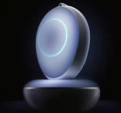

# Rokid语音产品设计指南

Rokid将基于自身打磨多年的历代产品经验，进行总结和归纳，并免费开放给用户。用户可以立即将Rokid优秀的语音整套解决方案，轻松地集成到具有麦克风和喇叭的联网设备上，打造业界优秀的语音交互产品(VoiceUI or VUI products)。

## ROP语音平台技术优势

- Rokid拥有完整自主知识产权的全功能语音链条；

- 远场语音识别的优化：Rokid积累了数年的远场语音真实数据，并用于自有的ASR引擎训练优化，针对智能家居、远距离控制等应用场景具备更好的识别率；

- 软硬件全流程的技术方案：从麦克风选型、阵列设计，到前端语音处理算法、云端建模，Rokid能够做到硬件和软件的全栈式优化的技术方案；

- 顶尖的本地和云端建模核心技术：Rokid的语音唤醒、识别、合成以及语义理解，均采用了业界最新最先进的算法建模技术，包括CTC、DeepCNN、LSTM等End To End的语音语义建模算法，结合真实的用户数据，能够达到业界最好的识别和理解水平；

- 高度灵活和可定制的云端语义理解技术：我们的NLU开放平台可由用户来完成全部订制，并可为用户提供专门的理解模型的训练；

- TTS定制和变声技术：为用户提供TTS模型订制以及变声订制（其他平台很少提供这样的服务）；

## 典型产品示例
开启若琪VUI的方式有两种：触摸以及语音激活；触摸可以通过遥控器或者手机APP，语音则是叫一声“若琪”，类似若琪和若琪•月石的激活词。

|  | || |
| --- | --- | --- |---|
|  应用场景| 触摸(<0.5m) | 2-3米激活词 |3-5米激活词 |
|  智能音箱|  | ● |● |
|  遥控器| ●  | | |
|  手机APP| ●  | | |
|  OTT/机顶盒| ●  |● | ●|
|  智能家居|  |● | ●|
|  车载 |  |● | ●|

## 工业设计和结构设计指南

### 工业设计指南
为保证语音体验的完好，建议水平设置；
如果产品设计所需，麦克风的倾斜角度必须<30度。

### 麦克风阵列排布

**① 均匀圆形阵列**

| 数量 | 设计半径R |
| --- | --- |
| 4 | 18mm&lt;R&lt;=30mm | 
| 6 | 25mm&lt;R&lt;=43mm | 
| 8  | 30mm&lt;R&lt;=56mm | 
| 16  | 60mm&lt;R&lt;=110mm | 

**② 均匀线性阵列**

| 数量 | 设计间距L |
| --- | --- |
| 2-8 | 30mm&lt;L&lt;=60mm(43mm最佳) | 

## 硬件芯片方案

### 支持业界主流应用处理器AP

Rokid开放平台的远距离拾音技术可轻松地移植到支持Android与Linux平台的AP：

- Samsung
- Amlogic
- Qualcomm
- Allwinner
- Others

### 第三方降噪方案的集成

Rokid开放平台可以将业界优秀的语音激活与降噪芯片厂商，集成到平台中，并与云端的语音识别技术配合，共同提供整体解决方案：

- XMOS
- Others

### 麦克风选型参考

语音方案支持业界主流麦克风：

- I2S
- PDM
- Analog

建议用户在保证成本的同时，从信噪比SNR、灵敏度Sensitivity、相位一致性以及SPL曲线特征等参数进行选择。

