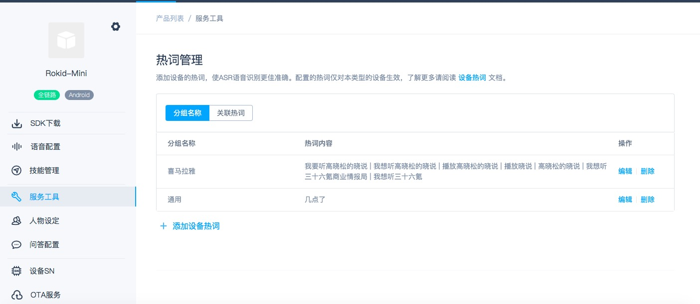

### 设备热词和拦截器

#### 设备热词

用户可以在开发平台语音接入处添加设备热词，可以提高本类型设备上 ASR 语音识别的准确率。当设备接收到语音时，ASR语音识别会优先命中热词。每个设备最多可以添加10组热词，每组热词最多500个，每个词最长不超过16个字。

为您的设备添加全局热词

您添加热词组，不与任何技能关联时，则将作为全局热词处理，即该类型的设备使用任意技能时语音识别都会优先命中热词。 操作步骤： 创建热词组为其命名，并添加热词的内容，保存后即可。
为您的设备添加技能热词

当您的设备在使用特定技能的特定句式时，需要用到热词，则需要将热词组与相应技能的具体词表进行关联。

可关联的技能包括：该类型设备接入的核心技能、该类型设备接受授权的私有技能、该类型设备上开启的所有公有技能。
操作步骤： 例如，该类型设备在使用一个相册技能时，需要提高「下页」、「下一页」这类向后翻页操作的语音识别准确率。
第一步，创建热词组 [向后翻页] 并添加「下页」、「下一页」这两个热词。
第二步，在关联技能列表选择【相册】技能
第三步，在【相册】词表中选择并关联向后翻页的词表-next
第四步，选择热词组 [向后翻页] ，并点击保存。

#### 拦截器

用户可以在开发平台语音接入处添加拦截器，可以允许开发者在进入若琪NLP匹配之前或者在若琪NLP处理完成后结果为空时将请求进行拦截，拦截到开发者自己的HTTPS拦截器。 您可以在「语音服务-服务接入-拦截器」中对此功能进行配置，详细请了解[拦截器接口文档](https://developer.rokid.com/docs/2-RokidDocument/1-SkillsKit/more-fuction.html)