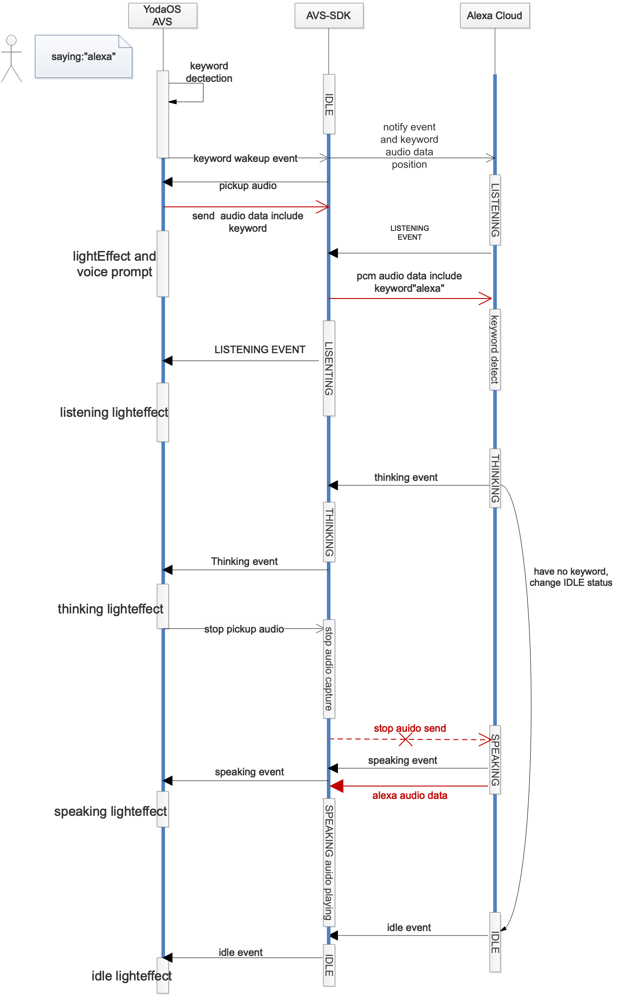
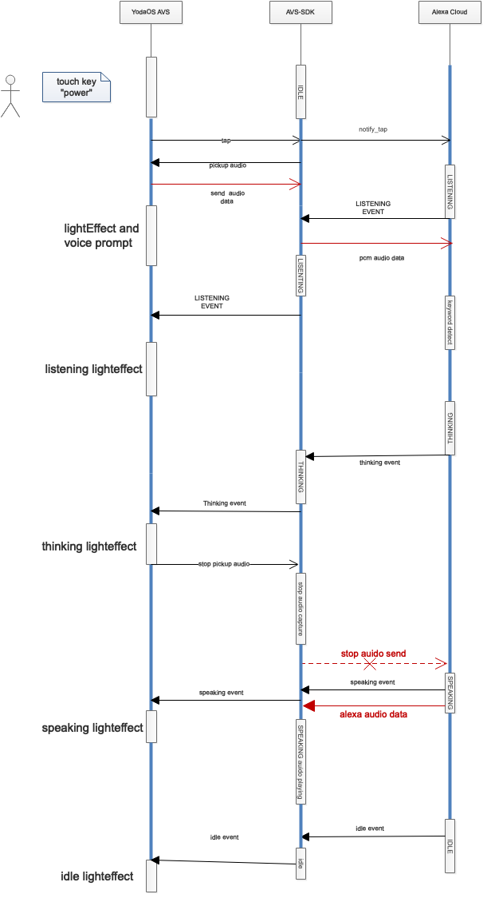
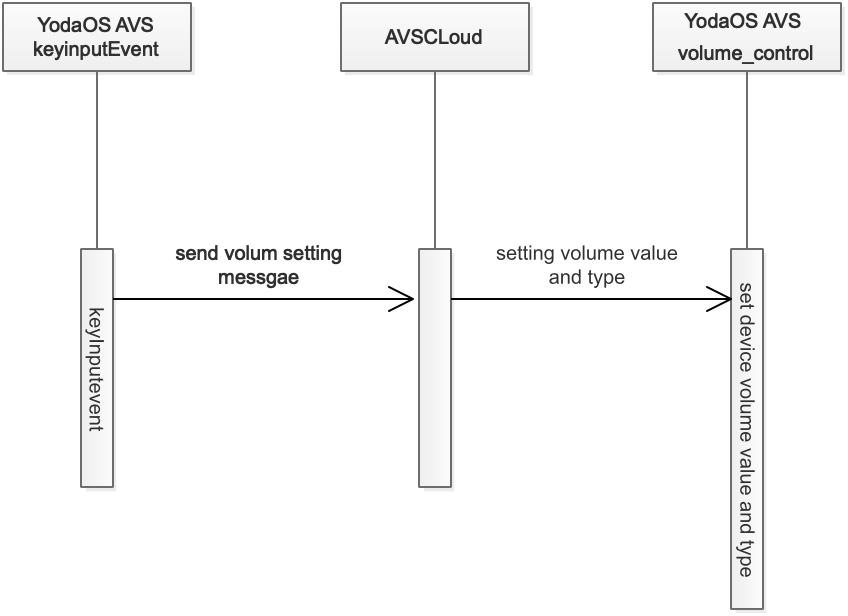
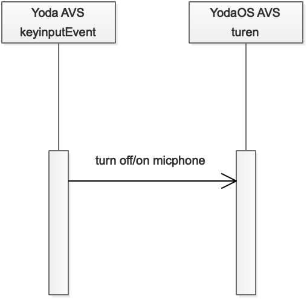
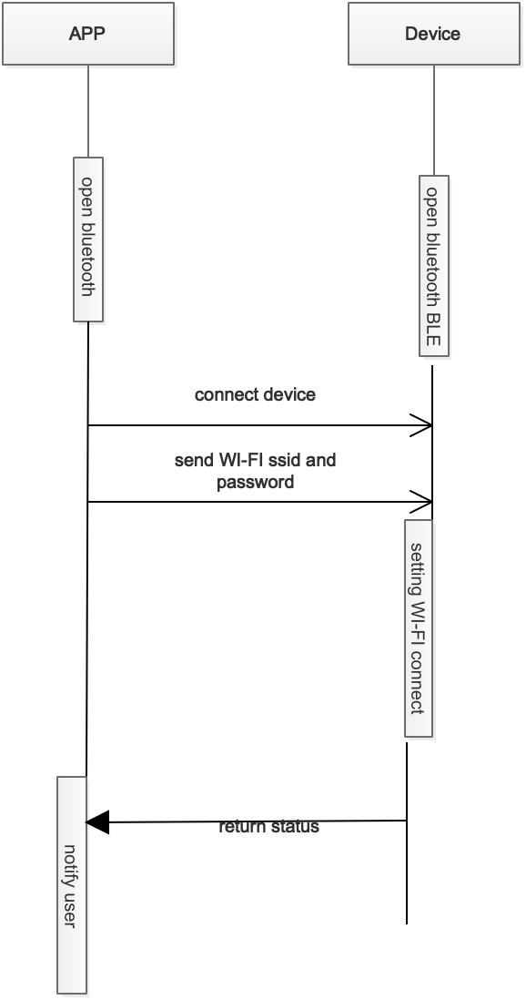
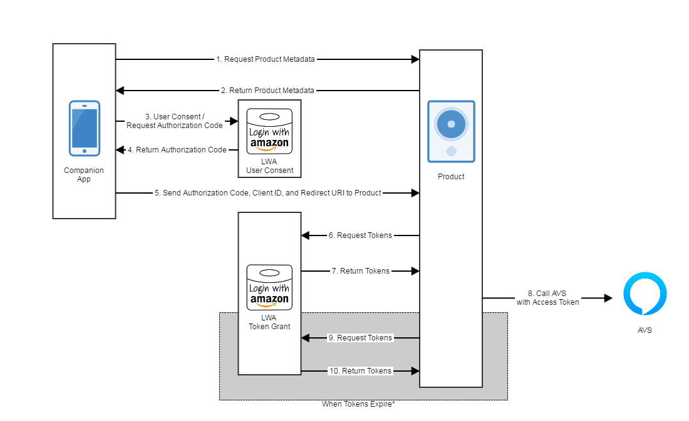
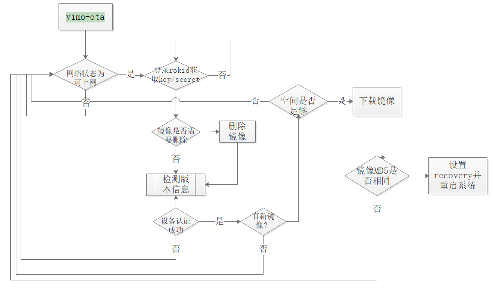

#3 功能流程

## 3.1 语音唤醒交互流程



用户通过关键词“alexa”唤醒alexa之后， YodaOS AVS方案中的前端模块会检测关键词事件，将关键词事件以及关键词在音频数据中的位置发送给AVS云端。

## 3.2 按键唤醒交互流程



用户通过按开发板上的power键， 唤醒alexa， 由alexa云端自己判断VAD。

## 3.3 音量大小调节流程




## 3.4 语音交互流程

语音交互流程包含在按键唤醒和语音唤醒流程中，参考 3.1和3.2


## 3.5 麦克风操作流程



YODAOS的的语音采集以及唤醒被turen模块接管，因此只需要turen模块进行操作就可以实现麦克风的关闭和打开。同时把相关的灯效和声音提示添加上去。

## 3.6 通知流程

暂无

## 3.7 报警流程

暂无


## 3.8 蓝牙配网流程



**蓝牙配网协议：**

**Bind**

```Javascript

```


## 3.9 Alexa 授权流程




Rokid的APP通过蓝牙和手机通讯， 手机获取metadata以及发送授权信息给设备，都是通过蓝牙。

下面是蓝牙通讯的协议。

###3.9.1 获取MetaData

**Request**

```javascript
{
	topic: "AlexaMetaData",
}
```

**Response**

```javascript
{
    topic:"AlexaMetaData",
    data:{
       "PID":"",
       "DSN":"",
       "Code":"",       
    }
}
```

PID: 是在亚麻孙注册的产品ID号，我们注册的是"RokidAlexa"，DSN：是设备序列号， Code：是挑战码，按照Alexa的官方要求生成的挑战码。[亚马孙官方说明](https://developer.amazon.com/zh/docs/alexa-voice-service/authorize-companion-app.html)

### 3.9.2 发送认证信息

``` javascript
{
    topic:"Auth",
    data:{
    "ACode":"",
    "ClientID":"",
    "RedirectURI":""
   }
}
```

相关字段参见[亚马孙官方说明](https://developer.amazon.com/zh/docs/alexa-voice-service/authorize-companion-app.html)


## 3.10 AVS OTA升级

### 概述

OTA升级是当设备在联网状态下，自动检测是否有最新版本镜像，有最新镜像则自动下载升级到最新版本，没有则定时检测版本。OTA升级可以让用户体验最新的功能．

#### OTA升级必备条件

- 完整OTA流程需要在[镜像服务器](https://developer.rokid.com/rokid-ota/ota/image/add)添加正确的版本和镜像。
- 设备必须可以连接网络。
- 设备空间比镜像包大，可以下载升级镜像包。

#### OTA升级流程

- 检测OTA镜像版本之前，需要查看当前网络状态。可以上网，则可以进行OTA镜像版本检测。
- 登录帐号服务器获取key和secret信息，用于检测时的设备认证。
- OTA镜像版本检测,若有镜像，则把**正确的镜像**下载到设备**/data/upgrade**目录，文件名是镜像的md5值(小写32位)，并使用`.img`后缀,用于确认下载的镜像是否正确，若没有最新镜像信息，则定期检测，当前设置是半个小时检测一次。
- 设置recovery接口,把升级镜像的路径设置进去,设置设备⾃动重启，进⼊升级状态，此时⽤户⽆法使⽤设备。
- 升级完成后，设备⾃动重启，开机并联⽹。

如下是OTA流程图：



<font color=red>**OTA镜像版本检测接口**</font>
以`https`的`POST`方法访问`https://apigwrest-dev.open.rokid.com`网址。

> 接口URL: https://apigwrest-dev.open.rokid.com/v1/extended/ota/check

在OTA镜像检测之前需要从开发者平台获取获取key和secret信息，用于后面的设备认证。

***设备认证***：
设备向`https://apigwrest-dev.open.rokid.com`发起OTA镜像版本检测请求时，需要在HTTP请求头部中增加字段Authorization。Authorization字段内容如下所示：

```
version={version};time={time};sign={sign};key={key};device_type_id={device_type_id};device_id={device_id};service={service}
```

Authorization中的sign字段是签名串，是对下列组合的字符串（UTF-8编码）做MD5计算:

```
key={key}&device_type_id={device_type_id}&device_id={device_id}&service={service}&version={version}&time={time}&secret={secret}
```

字段说明

| 字段名称       | 意义                                         |
| -------------- | :------------------------------------------- |
| version        | 版本，当前为1.0                              |
| time           | UNIX时间                                     |
| sign           | 签名串，具体⽣成⽅式如上所示                 |
| key            | 授权KEY，从开发者平台获取                    |
| device_type_id | 设备类型ID，同样从开发者平台获取             |
| device_id      | 设备ID，客户端⾃⼰维护                       |
| service        | 服务类型，⾃定义，建议与请求的服务名保持⼀致 |
| secret         | 密钥，从开发者平台获取                       |

HTTP请求头部中还需要字段Content-Type，字段信息如下：

```
Content-Type: application/json;charset=utf-8
```

HTTP请求体由json串组成，内容如下所示：

```
  {"version":"XXXXX"}
```

请求体中`version`字段是必须字段，其他字段可以根据需要添加。

响应返回结果：

```
{
 /**镜像地址**/
 "imageUrl": "http://xxxx.img",		//必须
 
 /**是否成功**/
 "authorize": true,	//必须
 
 /**错误信息**/
 "errorMessage": "",
 
 /**错误码**/
 "code": "OK",
 
 /**变更说明**/
 "changelog": "",
 
 /**镜像md5**/
 "checksum": "xxxx",	//必须
 
 /**是否强制升级**/
 "isForceUpdate": true,
 
 /**镜像版本**/
 "vertion": "3.0.0-xxxx-xxx"	//必须
 
}
```

<font color=red　face="黑体">对于设备的OTA镜像升级，如果需要自己实现，可以参考如上信息。</font>

